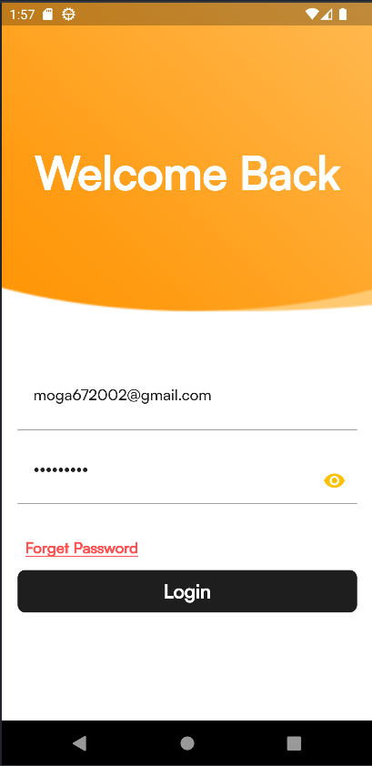
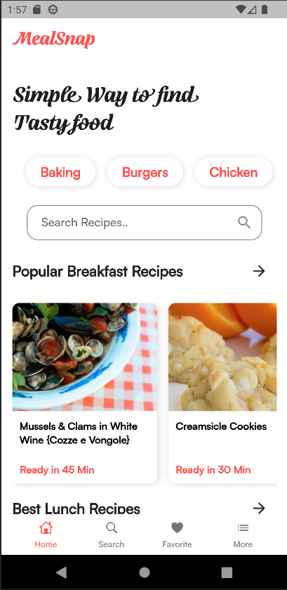
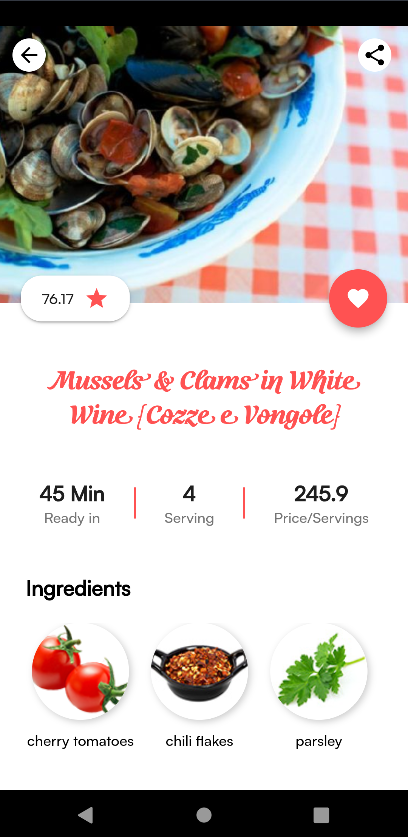
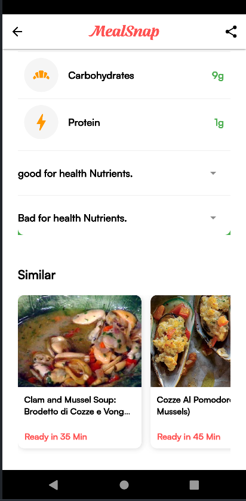
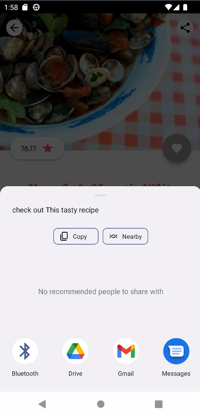
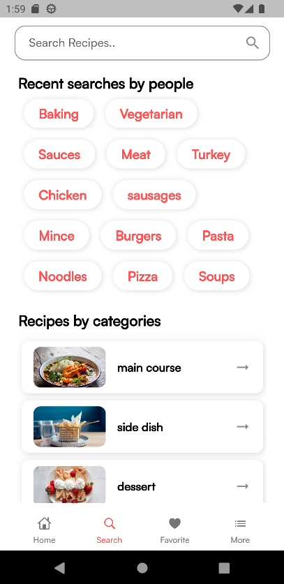
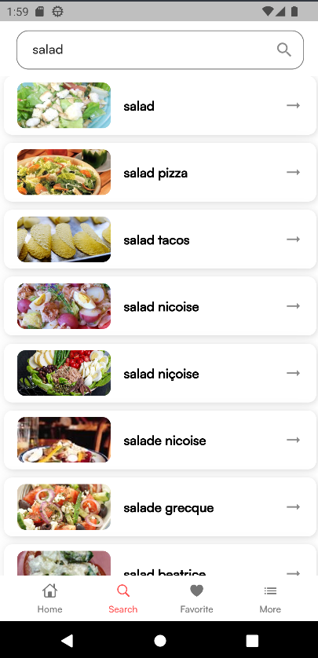
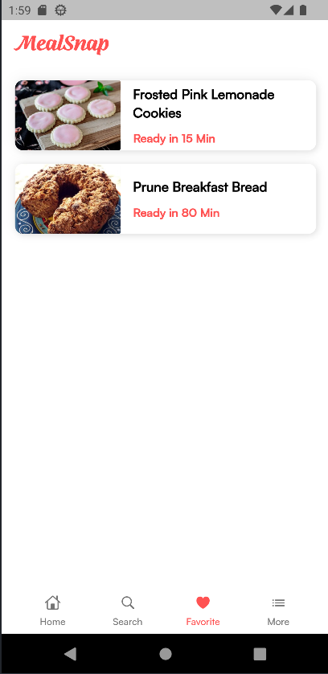
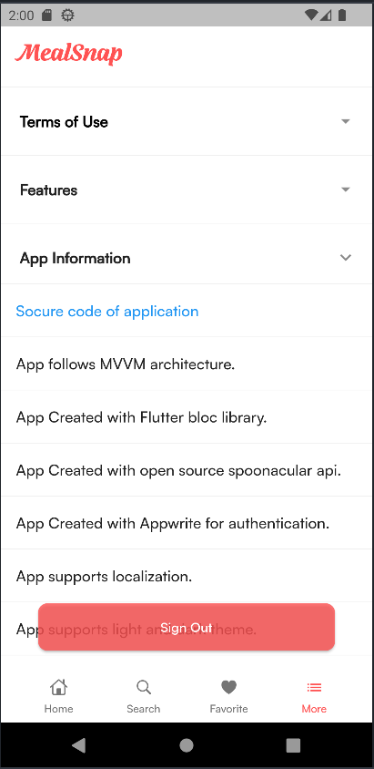

# 🔥 Flutter Meal Snap App

## ✨ Features :

- MVVM Architecture.
- Bloc State Management.
- Spoonacular API.
- Caching data/Offline (Hive).
- Responsive UI.
- Reusable Widgets.
- Beautiful UI and Animation.
- Saving favorite recipes.
- Search recipes by name, ingredients, or type.
- Nutrition information for each meal.
- 5,000+ recipes.
- related recipes.
- and more...

## 📹 Video Demo : [Flutter Meal Snap App](https://drive.google.com/file/d/1CDryxG5Aqh7WWATtzZIAeGCoZ1y1zS3g/view?usp=sharing)

## 📸 Screenshots :

  
  
  
 

##